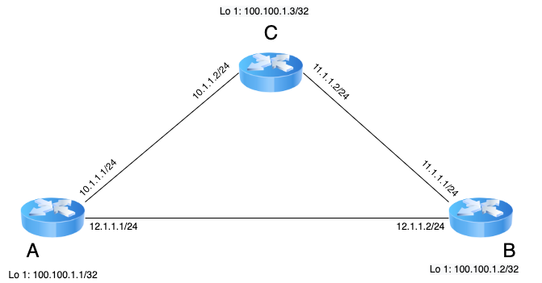

# TLV (<span style="color: green"> T</span>type <span style="color: green"> L</span>ength <span style="color: green"> V</span>alue)

It is a very common scenario in networking that machines often exchange messages
with each other. Many internet routing protocols necessitate machines to exchange
various messages with each other periodically. For example, OSPF exchange their link-state
packets with other routers in the network for their proper functioning.
Let's look at the below topology:



Suppose each router sends control messages to each other. When A sends its control message to B and C, they simply type-cast the received data and access each item via pointer.

The problem in such exchange of messages arises due to the heterogeneity of communicating machines. To elaborate this, let's start with some coding concepts:

Suppose the control message has the following structure (we assume the system is 32bit):
```
struct xmsg{
   uint loopback_ip;
   char router_name[32];
   uint if_addr1;
   uint if_addr2;
   uint link1_bw;
   uint link2_bw;
};
```
|Field|Size|Offset|
|:------:|:----:|:-------:|
|Loopback|4|0|
|Router_name|32|4|
|if_addr1|4|36|
|if_addr2|4|40|
|link1_bw|4|44|
|link2_bw|4|48|

So, according to above chart, the meaning of below code is: **Reading/writing 4bytes at 40th byte from starting address**
```
struct xmsg *ptr;
ptr->if_addr2;
```
